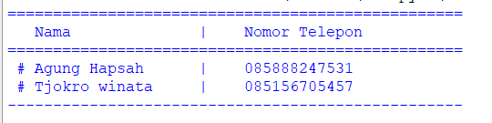
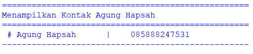
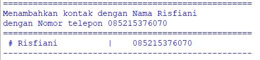
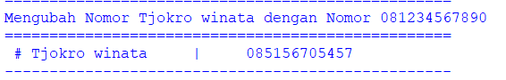
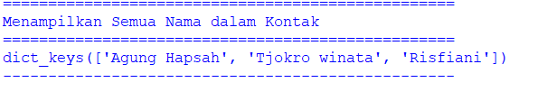
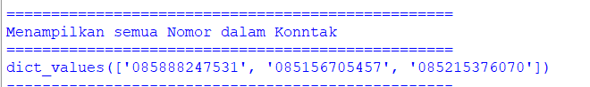
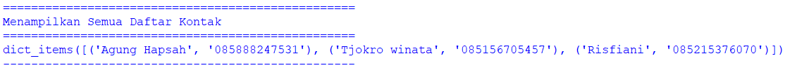
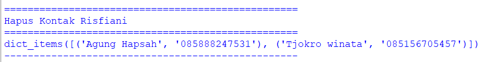

# labspy05
## BAHASA PEMOGRAMAN
### Latihan 1
#### Membuat daftar kontak menggunakan dictionary di python

```python
jadi kali ini kita akan membuat daftar kontak menggunakan dictionary dan berikut langkah dan keterangan nya
```
- Keterangan
```python
daftarkontak = {"Nama":"Nomor Telepon"}
kontak = {"Agung Hapsah":"085888247531", "Tjokro winata":"085156705457"}
```
- Berikut merupakan programnya


#### Kondisi 1
```python
print("="*50)
print("   Nama              |    Nomor Telepon   " )
print("="*50)
print(" # Agung Hapsah      |   ", kontak["Agung Hapsah"])
print(" # Tjokro winata     |   ", kontak["Tjokro winata"])
print("-"*50)
print()
print()
print("="*50)
```
### Berikut hasil dari programnya

### kondisi 2
```python
print("Menampilkan Kontak Agung Hapsah")
print("="*50)
print(" # Agung Hapsah      |   ", kontak["Agung Hapsah"])
print("-"*50)
print()
print()
print("="*50)
```
### Berikut hasil programnya

### Kondisi 3
```python
print("Menambahkan kontak dengan Nama Risfiani")
print("dengan Nomor telepon 085215376070")
kontak["Risfiani"]="085215376070"
print("="*50)
print(" # Risfiani          |   ", kontak["Risfiani"])
print("-"*50)
print()
print()
print("="*50)
```
### Berikut hasil programnya

### kondisi 4
```python
print("Mengubah Nomor Tjokro winata dengan Nomor 081234567890")
print("="*50)
print(" # Tjokro winata     |    ", kontak["Tjokro winata"])
print("-"*50)
print()
print()
print("="*50)
```
### Berikut hasil programnya

### Kondisi 5
```python
# Menampilkan semua Nama
print("Menampilkan Semua Nama dalam Kontak")
print("="*50)
print(kontak.keys())
print("-"*50)
print()
print()
print("="*50)
```
### Berikut hasil programnya

### Kondisi 6
```python
print("Menampilkan semua Nomor dalam Konntak")
print("="*50)
print(kontak.values())
print("-"*50)
print()
print()
print("="*50)
```
### Berikut hasil programnya

### kondisi 7
```python
print("Menampilkan Semua Daftar Kontak")
print("="*50)
print(kontak.items())
print("-"*50)
print()
print()
print("="*50)
```
### Berikut hasil programnnya

### Kondisi 8
```python
print("Hapus Kontak Haikal")
print("="*50)
kontak.pop("Haikal") 
print(kontak.items())
print("-"*50)
print()
print()
```
### Berikut hasil programnya

## latihan1 selesai